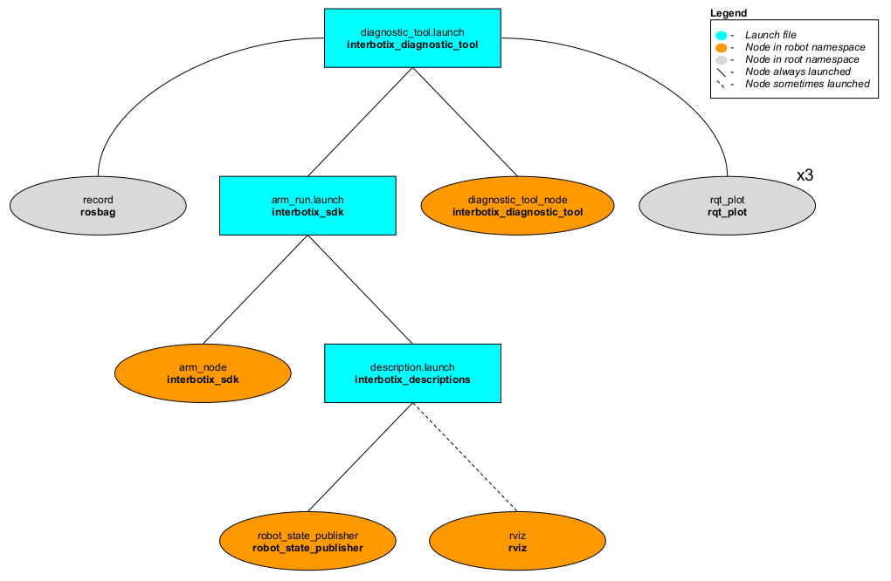

# interbotix_diagnostic_tool

## Overview
This package is meant to be used as a way to analyze joint data over time. For example, if the user would like the arm to perform a certain task but is not sure if it will 'strain' a specific arm joint too much, then this tool would be an easy way to record, save (to a rosbag and CSV file), and view data live while the joint in question rotates.

## Structure

As shown above, the *interbotix_diagnostic_tool* package builds on top of the *interbotix_sdk* package. To get familiar with the nodes in the *interbotix_sdk* package, please look at its README. The other nodes are described below:
- **diagnostic_tool_node** - responsible for commanding joint positions to the user-specified joint following a sinusoidal trajectory; the trajectory is symmetric around '0' radians where the upper bound is the minimum of the absolute value of the upper and lower joint limits. It also publishes temperatures at all the arm joints (excluding gripper) to the `/<robot_name>/joint_temperatures` topic
- **record** - responsible for recording the `/<robot_name>/joint/commands`, `/<robot_name>/joint_states`, and `/<robot_name>/joint_temperatures` topics and saving it to a user-specified bagfile
- **rqt_plot** - three instances of this node are launched to plot data for a user-specified joint; one plots the joint commands along with the observed joint positions [rad] and velocities [rad/s] vs. time [s]. Another plots effort [mA] vs time [s], while the last one plots joint temperature [C] vs. time [s].

## Usage
To use this package, first manually manipulate the arm (let's say the PincherX 150) until the desired starting pose is reached. Then type the command below:
```
$ roslaunch interbotix_diagnostic_tool diagnostic_tool.launch robot_name:=px150 cmd_joint:=0 joint_id:=0 bag_name:=px150_diagnostics
```
Keep holding the arm until the motors torque on. At this point, let go of the arm. Since the `cmd_joint` argument is `0`, this means that the 'waist' joint will begin to rotate following a sinusoidal trajectory. Additionally, since the `joint_id` argument is `0`, the plots will start showing data for the 'waist' joint only. The plot axes might have to be adjusted to visualize the data properly. The joint will then continue to rotate for the user-specified time (see the launch file argument table below) at which point the arm will go to its 'sleep' pose and the **diagnostic_tool_node** will terminate. Finally, the user should 'Cntrl-C' the launch file so that *rosbag* will stop recording data.

To convert the *rosbag* data to a csv file, navigate to the [scripts](scripts/) directory. If the 'bag2csv.py' program is not yet executable, make it so by typing:
```
chmod a+x bag2csv.py
```

Next, type:
```
$ python bag2csv.py px150 0 px150_diagnostics.bag px150_diagnostics.csv
```
The command is pretty self explanatory - just note that '0' is the ID of the joint from which to get data. To better understand how this program works, take a look at [bag2csv.py](scripts/bag2csv.py). Otherwise, take a look at the table below to understand the launch file arguments.

| Argument | Description | Default Value |
| -------- | ----------- | :-----------: |
| robot_name | name of a robot (ex. 'wx200') | "" |
| cmd_joint | Dynamixel ID representing the joint to rotate | 0 |
| joint_id | Dynamixel ID representing the joint for which to plot data | 0 |
| test_duration | duration of test in seconds | 600 |
| bag_name | name of the *rosbag* for which to save data | new_bag |

## Notes
To determine which Dynamixel ID goes with which joint, just do a service call to the `/<robot_name>/get_robot_info` service. Look at the outputted 'joint_names' and 'joint_ids' vectors. The index of an ID in the 'joint_ids' vector corresponds to the joint name at the same index in the 'joint_names' vector.

If choosing to rotate the 'waist' joint, make sure during the  initial step of manually positioning the arm that it is NOT rotated past the joint limit (+/-180 degrees). Otherwise, the cable connecting the 'waist' motor to the 'shoulder' motor(s) can be ripped out.

Finally, take a note of the [data](data/) directory in the package. After plotting and saving the data to a CSV, it might be a good idea to create a new directory to keep all the files together. There are already two of them here as demos. The [wx200_home_bearing](data/wx200_home_bearing) test-run was to see how 'stressed' the 'waist' motor was when rotating the bearing with the WidowX 200 arm in its 'home' pose. The [wx200_ext_bearing](data/wx200_ext_bearing) test-run was to see how 'stressed' the 'waist' motor was when rotating the bearing with the WidowX 200 arm in a somewhat extended pose.
