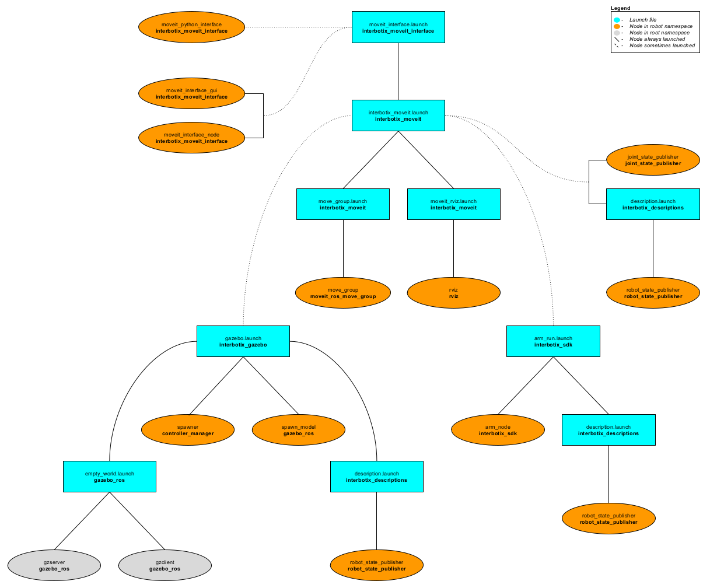

# interbotix_moveit_interface

## Overview
This package contains a small API modeled after the [Move Group C++ Interface Tutorial](https://github.com/ros-planning/moveit_tutorials/blob/kinetic-devel/doc/move_group_interface/src/move_group_interface_tutorial.cpp) that allows a user to command desired end-effector poses to an Interbotix arm. It is not meant to be all-encompassing but rather should be viewed as a starting point for someone interested in creating their own MoveIt interface to interact with an arm. The package also contains a small GUI that can be used to pose the end-effector.

## Structure

As shown above, this package builds on top of both the *interbotix_gazebo* and *interbotix_sdk* packages. To get familiar with those packages, please refer to their respective READMEs. The *interbotix_moveit_interface* nodes are described below:
- **moveit_interface_node** - a small API that makes it easier for a user to command custom poses to the end-effector of an Interbotix arm; it uses MoveIt's planner behind the scenes to generate desired joint trajectories
- **moveit_interface_gui** - a GUI (modeled after the one in the *joint_state_publisher* package) that allows a user to enter in desired end-effector poses via text fields or sliders; it uses the **moveit_interface_node** API to plan and execute trajectories

## Usage
To run this package on the physical robot, type the line below in a terminal (assuming the ViperX 300 is being launched).
```
$ roslaunch interbotix_moveit_interface moveit_interface.launch robot_name:=vx300 use_actual:=true
```
A GUI should pop-up similar to the one below. In it, a user should specify the desired position and orientation of the end-effector (as defined by the 'ee_arm_link' w.r.t. the 'world' frame). This can be done either via the slider bars or by entering values into the text fields. Next, a user can press one of five buttons. They are:
- **Plan Pose** - MoveIt will attempt to find a trajectory that places the end-effector at the desired position and orientation
- **Plan Position** - MoveIt will attempt to find a trajectory that places the end-effector at the desired position, ignoring orientation
- **Plan Orientation** - MoveIt will attempt to find a trajectory that places the end-effector at the desired orientation, ignoring position; note that the planner fails more often than not for this option
- **Execute** - Once a valid plan has been found, this button can be pressed to actually execute the trajectory on the robot
- **Reset** - This resets all slider bars to the middle and text fields to '0.00'

Note that occasionally, MoveIt will be unsuccessful in finding a valid trajectory. This could be for one of two reasons. Either the desired pose is not physically attainable by the arm or the random seed generated by MoveIt was a bad guess. If it is clear that the pose is physically attainable, try hitting the desired 'Plan' button a few more times.

<p align="center">
  
</p>

This is the bare minimum needed to get up and running. Take a look at the table below to see how to further customize with other launch file arguments.

| Argument | Description | Default Value |
| -------- | ----------- | :-----------: |
| robot_name | name of a robot (ex. 'wx200') | "" |
| use_gazebo | launch MoveIt with a Gazebo simulated robot | false |
| use_actual | launch MoveIt with the physical robot | false |
| arm_operating_mode | if using the physical robot, set this to either "position" or "velocity" to let the *interbotix_sdk* node know whether to command the joint positions or velocities from the MoveIt JointTrajectory to the motors | position |
| dof | the degrees of freedom of the arm; the PincherX 100 is the only arm with four dof - all the others have five or six | 5 |
| moveit_interface_gui | launch a custom GUI to interface with the **moveit_interface_node** so that the user can command specific end-effector poses (defined by 'ee_arm_link') | true |
